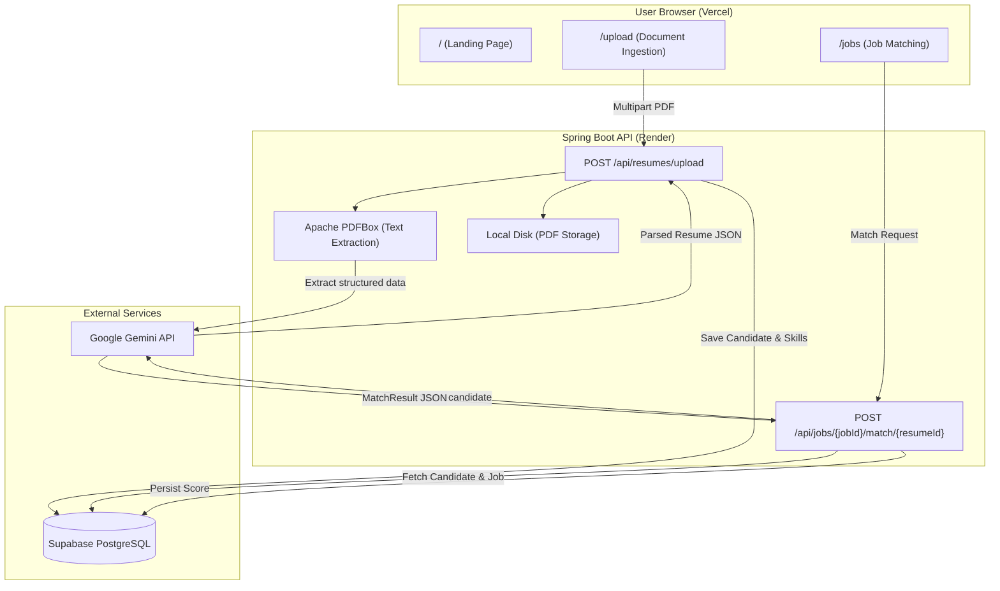

# ResumeAI — AI-Powered Resume Checker

**🔗 Live Site: [resumekaai.vercel.app](https://resumekaai.vercel.app/)**

> **⚠️ Note on First Use:** The backend is hosted on a free Render instance which spins down after 15 minutes of inactivity. When you first use the site, **please allow ~60 seconds** for the backend to wake up and process your request.

An intelligent, full-stack application that parses candidate CVs, extracts structured data using Google Gemini AI, and matches candidates against job descriptions with explainable scoring.

## Table of Contents

- [Key Features](#key-features)
- [Tech Stack](#tech-stack)
- [Architecture Overview](#architecture-overview)
- [Database Schema](#database-schema)
- [API Reference](#api-reference)
- [Prerequisites](#prerequisites)
- [Getting Started (Local Development)](#getting-started-local-development)
- [Environment Variables](#environment-variables)
- [Available Scripts](#available-scripts)
- [Deployment](#deployment)

---

## Key Features

- **AI Resume Parsing** — Upload a PDF and Gemini extracts name, contact info, skills (with proficiency & years of experience), work history, and education into structured JSON.
- **Job Description Matching** — Paste any job description and get an AI-generated match score (0-100), matching skills, missing skills, strengths, and concerns.
- **Candidate Shortlisting** — Candidates scoring above a configurable threshold are automatically flagged as shortlisted.
- **Duplicate Detection** — SHA-256 file hashing prevents the same resume from being processed twice.
- **Newsprint UI** — Stark, editorial-style React frontend with a "printed newspaper" aesthetic.

---

## Tech Stack

| Layer | Technology |
|---|---|
| **Frontend** | React 19, TypeScript, Vite 8, Tailwind CSS v4, React Router v7, Axios |
| **Backend** | Java 21, Spring Boot 3.3, Spring AI 1.0 (M1), Spring Data JPA |
| **AI** | Google Gemini API (gemini-2.5-flash) via native REST |
| **PDF Parsing** | Apache PDFBox 3.0 |
| **Database** | PostgreSQL 16+ |
| **ORM & Migrations** | Hibernate 6, Flyway 10 |
| **Containerization** | Docker, Docker Compose |
| **Frontend Hosting** | Vercel |
| **Backend Hosting** | Render |
| **Database Hosting** | Supabase (managed PostgreSQL) |

---

## Architecture Overview



### Backend Package Structure

```
backend/src/main/java/com/resumechecker/
+-- ResumeCheckerApplication.java    # Spring Boot entry point
+-- config/
|   +-- WebConfig.java               # CORS configuration
+-- controllers/
|   +-- ResumeController.java        # Resume upload, list, delete endpoints
|   +-- JobController.java           # Job CRUD + match endpoint
+-- services/
|   +-- ResumeProcessingService.java # Full upload pipeline orchestration
|   +-- PdfParserService.java        # PDFBox text extraction
|   +-- FileStorageService.java      # Disk persistence + SHA-256 hashing
|   +-- LlmExtractionService.java    # Gemini native API -> ParsedResumeDto
|   +-- LlmMatchingService.java      # Gemini -> MatchResult scoring
|   +-- MatchEngineService.java      # Matching pipeline orchestration
+-- models/                          # JPA entities (Resume, Candidate, Skill, etc.)
+-- repositories/                    # Spring Data JPA interfaces
+-- dto/                             # Request/Response data objects
```

### Frontend Page Structure

```
frontend/src/
+-- App.tsx                          # Router with 3 routes
+-- pages/
|   +-- LandingPage.tsx              # Hero, features, CTA
|   +-- UploadPage.tsx               # PDF drag-and-drop + intake ledger
|   +-- JobsPage.tsx                 # Job creation + match results
+-- components/
|   +-- Navbar.tsx
|   +-- ui/                          # Button, Card, Badge primitives
|   +-- original/                    # Domain-specific components
+-- lib/
    +-- api.ts                       # Axios client + typed API functions
```

---

## Database Schema

All tables use UUID primary keys via PostgreSQL's `gen_random_uuid()`.

```
resumes
+-- id              UUID PK
+-- filename        VARCHAR(255)
+-- file_path       VARCHAR(512)
+-- file_hash       VARCHAR(64) UNIQUE   <- duplicate detection
+-- raw_text        TEXT
+-- parsed_json     JSONB
+-- parse_status    VARCHAR(20)          <- pending | processing | completed | failed
+-- upload_date     TIMESTAMPTZ
+-- deleted_at      TIMESTAMPTZ

candidates  (one-to-one with resumes)
+-- id, resume_id FK, name, email, phone, summary

skills  (one-to-many from candidates)
+-- id, candidate_id FK, skill_name, proficiency, years_exp

experiences  (one-to-many from candidates)
+-- id, candidate_id FK, company, role, start_date, end_date, description

educations  (one-to-many from candidates)
+-- id, candidate_id FK, institution, degree, field, graduation_year

job_descriptions
+-- id, title, raw_text, required_skills JSONB

match_results
+-- id, candidate_id FK, job_id FK
+-- score INT (0-100)
+-- justification TEXT
+-- matching_skills JSONB, missing_skills JSONB
+-- strengths JSONB, concerns JSONB
+-- shortlisted BOOLEAN
```

---

## API Reference

### Resumes

| Method | Endpoint | Description |
|---|---|---|
| `POST` | `/api/resumes/upload` | Upload a PDF. Returns `{ resumeId, status }`. |
| `GET` | `/api/resumes` | List all resumes with parse status and data. |
| `GET` | `/api/resumes/{id}` | Get a single resume by ID. |
| `DELETE` | `/api/resumes/{id}` | Delete resume and all associated data. |

### Jobs & Matching

| Method | Endpoint | Description |
|---|---|---|
| `POST` | `/api/jobs` | Create a job description `{ title, rawText }`. |
| `GET` | `/api/jobs` | List all job descriptions. |
| `POST` | `/api/jobs/{jobId}/match/{resumeId}` | Run AI match. Returns full MatchResult. |
| `GET` | `/api/jobs/{jobId}/matches` | Get all matches for a job. |

---

## Prerequisites

- **Java 21** (JDK) — [Download Temurin](https://adoptium.net/)
- **Maven 3.9+**
- **Node.js 20+** and **npm**
- **Docker & Docker Compose** (for local database)
- **Google Gemini API Key** — free at [Google AI Studio](https://aistudio.google.com/app/apikey)

---

## Getting Started (Local Development)

### 1. Clone the Repository

```bash
git clone https://github.com/Wrathemperor/Resume-Checker.git
cd Resume-Checker
```

### 2. Set Up Environment Variables

```bash
cp .env.example .env
```

At minimum, set these in `.env`:

```env
GEMINI_API_KEY=AIzaSy...
VITE_API_BASE_URL=http://localhost:8000/api
```

### 3. Start the Database

```bash
docker compose up db -d
```

Postgres 16 will start on port 5432 with credentials `postgres/postgres`.

### 4. Run the Backend

```bash
cd backend

# PowerShell
$env:DATABASE_URL = "jdbc:postgresql://localhost:5432/resume_checker"
$env:DB_USER = "postgres"
$env:DB_PASSWORD = "postgres"
$env:GEMINI_API_KEY = "AIzaSy..."

mvn spring-boot:run
```

The server starts on **http://localhost:8000**. Flyway automatically creates all database tables on first startup.

### 5. Run the Frontend

```bash
cd frontend
npm install
npm run dev
```

Open **http://localhost:5173** in your browser.

### 6. Full Stack with Docker Compose (Alternative)

```bash
# Ensure .env has GEMINI_API_KEY set
docker compose up --build
```

- Frontend: http://localhost:80
- Backend: http://localhost:8000/api

---

## Environment Variables

### Backend (Render Environment Variables)

| Variable | Required | Description | Example |
|---|---|---|---|
| `GEMINI_API_KEY` | Yes | Google Gemini API Key | `AIzaSy...` |
| `SPRING_DATASOURCE_URL` | Yes | JDBC connection string | `jdbc:postgresql://...?prepareThreshold=0` |
| `SPRING_DATASOURCE_USERNAME` | Yes | Database username | `postgres` |
| `SPRING_DATASOURCE_PASSWORD` | Yes | Database password | `your-password` |
| `LLM_MODEL` | No | Gemini model name | `gemini-2.5-flash` |
| `LLM_TEMPERATURE` | No | AI temperature (0-1) | `0.1` |
| `SHORTLIST_THRESHOLD` | No | Min score to shortlist | `7` |
| `UPLOAD_DIR` | No | PDF storage directory | `./uploads` |

### Frontend (Vercel Environment Variables)

| Variable | Required | Description | Example |
|---|---|---|---|
| `VITE_API_BASE_URL` | Yes | Backend API base URL | `https://your-app.onrender.com/api` |

> **Important:** After changing `VITE_API_BASE_URL` in Vercel, you must **redeploy**. Vite bakes this value into the JS bundle at build time.

---

## Available Scripts

### Backend

```bash
mvn spring-boot:run          # Start dev server
mvn package -DskipTests      # Build production JAR
mvn test                     # Run test suite
mvn clean                    # Clean build artifacts
```

### Frontend

```bash
npm run dev        # Vite dev server with hot reload (http://localhost:5173)
npm run build      # Type-check and build for production
npm run preview    # Preview the production build locally
```

### Docker Compose

```bash
docker compose up --build        # Build and start all services
docker compose up db -d          # Start only the database
docker compose down              # Stop all services
docker compose down -v           # Stop and delete all data volumes
docker compose logs backend -f   # Tail backend logs
```

---

## Deployment

### Backend (Render)

1. Go to Render Dashboard -> **New Web Service**
2. Connect your GitHub repository, set **Root Directory** to `backend`
3. Render auto-detects the `Dockerfile`
4. Add environment variables (GEMINI_API_KEY, SPRING_DATASOURCE_URL, etc.)
5. Deploy — Flyway creates all tables automatically on first boot

### Frontend (Vercel)

1. Go to Vercel Dashboard -> **Add New Project**
2. Import your GitHub repository, set **Root Directory** to `frontend`
3. Add `VITE_API_BASE_URL` = `https://your-render-app.onrender.com/api`
4. Deploy

### Database (Supabase)

1. Create a project at [supabase.com](https://supabase.com)
2. Go to **Settings -> Database -> Connection String -> URI** (Transaction mode, port 6543)
3. Convert to JDBC format and append `?prepareThreshold=0`:
   ```
   jdbc:postgresql://aws-0-REGION.pooler.supabase.com:6543/postgres?prepareThreshold=0
   ```
4. Set this as `SPRING_DATASOURCE_URL` in Render


Built with ❤️ by Anvay

